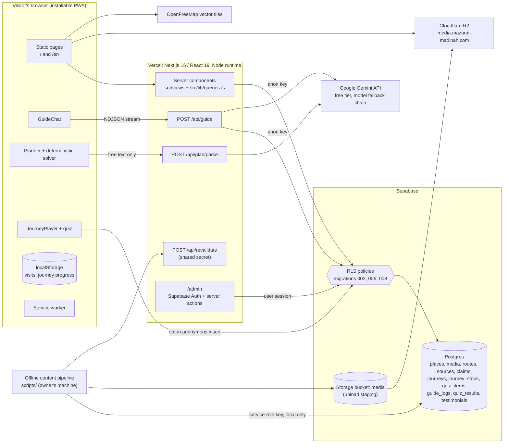
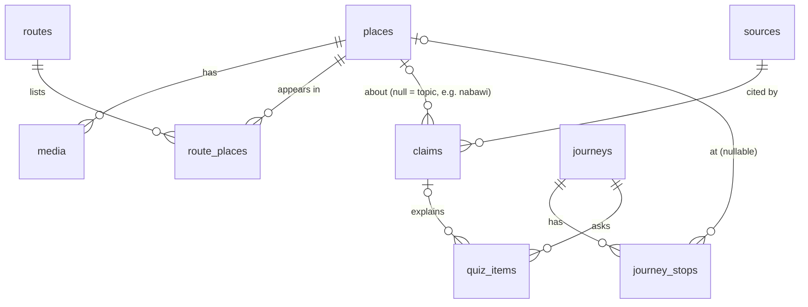
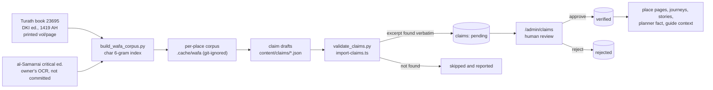
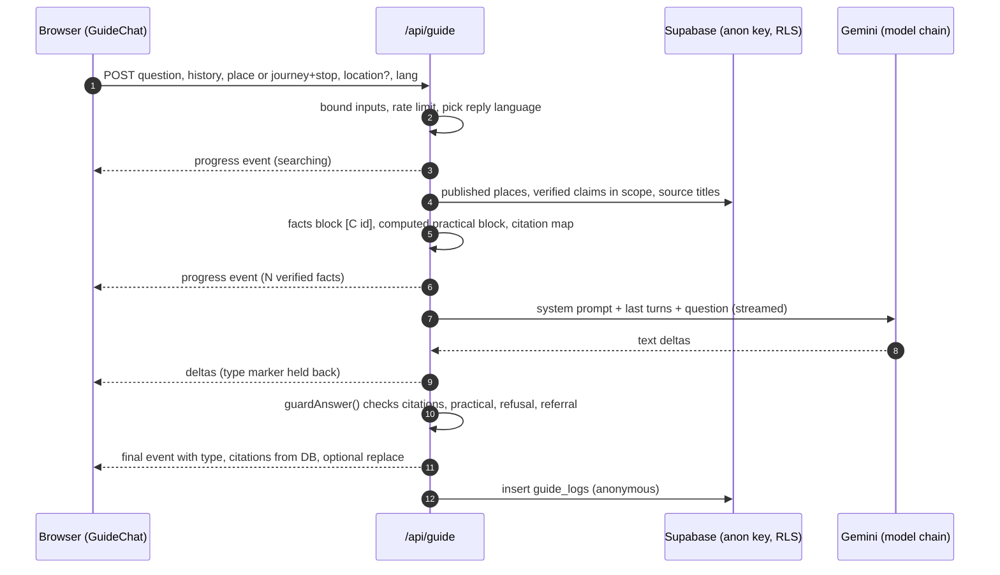
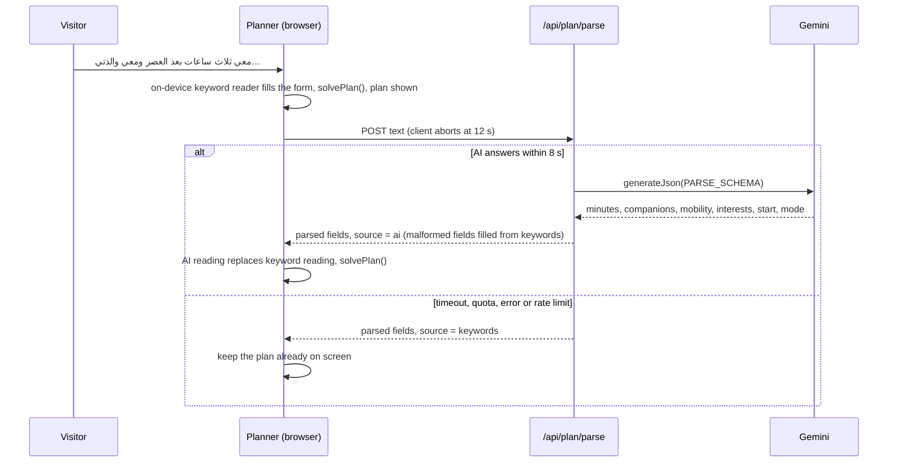

# Architecture

**مزارات المدينة / Mazarat Madinah**: <https://www.mazarat-madinah.com> (English at `/en`)
Bathel Foundation "AI Challenge Serving Islamic Content", Track 3: interactive experiences and knowledge journeys.

This document explains how the system works, for a technical reviewer. Each statement names the file that implements it, so it can be checked in the code.

- **Snapshot:** commit `b0f1f89` on `master`, 6 October 2026 (the last day of the build window). Baseline tag: `pre-hackathon`. `CHANGELOG.md` lists milestones M0–M5; M6 (human stories, journey tags, visitor testimonials, "how far am I") is described in the message of commit `b0f1f89`. `git diff pre-hackathon..master` shows the code.
- **Labels used below:** **Built** means it is on `master` and live on the site. **Planned** means the team has committed to it but it has not started. **Not started** means a possible next step with no work done.
- **Related documents:** `SOURCES.md` covers content provenance and the review method. `README.md` covers the product and operations.

---

## 1. The system in one paragraph

A statically rendered Next.js site (Arabic at `/`, English at `/en`) reads published content from Supabase Postgres with the public anon key. Row-level security (RLS) decides what a visitor may read. Every sourced historical or religious fact added during the challenge (what the AI guide may say, the human stories, the planner's fact per stop, the sources of each journey stop) is a row in one table, `claims`. Journey stop texts are written from those claims, cite them (`journey_stops.claim_ids`) and are reviewed separately. Each claim records a printed volume and page in *Wafa al-Wafa* and a verbatim excerpt from that page. Visitors can read a claim only after a human has approved it (`status = 'verified'`). Place pages also show texts written before the challenge under the owner's review (summary, story, virtue and featured quote in `places`). Those are not claims and are not linked to claim ids; any part still marked `[VERIFY: …]` is stripped from public pages (`stripVerify()` in `src/lib/content.ts`), and the guide never uses them (see `SOURCES.md`). The AI (Google Gemini) works on two narrow paths:

- **The guide.** The model may only rephrase verified claims that the server hands it, and it must cite each one as `[C<id>]`. The server checks those citations.
- **The trip planner.** The model only turns the visitor's free text into a few form fields. A deterministic solver then builds the route.

Neither path can block the site. Pages render without AI. The planner reads the request on the device first. The guide ends in a clean "unavailable" message when the model fails.

## 2. Components



| Component | Responsibility | Code |
|---|---|---|
| Public pages | Home, places, place pages, map, routes, photo tours, journeys, human stories, My journey, planner, privacy. They render on the server and are cached as static pages that regenerate in the background (ISR). | `src/app/(ar)/**`, `src/app/(en)/en/**`, shared views in `src/views/*.tsx` |
| Data access | A cookie-less anon client for public reads, with per-language localisation of rows | `src/lib/queries.ts`, `src/lib/i18n-content.ts` |
| AI guide | Builds the context in code, streams the answer, then runs the server-side citation guard | `src/app/api/guide/route.ts`, `src/lib/guide/{context,prompt,answer}.ts` |
| Planner | AI request parsing with a time budget and a keyword fallback. The solver is pure TypeScript and runs in the browser. | `src/app/api/plan/parse/route.ts`, `src/lib/planner/{parse,solver}.ts`, `src/components/planner/Planner.tsx` |
| Journeys | Pre-quiz, stops, post-quiz, an anonymous opt-in result and an optional testimonial form; tag filter on the list page | `src/components/journey/*`, `src/lib/journey-view.ts`, `src/lib/visits.ts` |
| Human stories (M6) | Verified claims of kind `humane`, grouped by theme, each with its source line | `src/lib/stories.ts`, `src/views/stories.tsx`, `src/components/stories/*` |
| Testimonials (M6) | Visitor form with explicit consent, admin moderation, approved entries on the home page | `src/components/journey/TestimonialForm.tsx`, `src/lib/testimonials.ts`, `src/components/home/Testimonials.tsx` |
| "How far am I" (M6) | Distance and walking or driving time to a place, computed on the device after a tap | `src/components/place/DistanceToHere.tsx` |
| Gemini wrapper | Model tiers from env vars, a fallback chain, JSON-schema output and streaming | `src/lib/ai/gemini.ts` |
| Admin | Review of claims, journey stops, quiz items and testimonials; place editor; practical-info editor; QR sheet; hotel card | `src/app/(ar)/admin/(protected)/**`, `src/lib/admin-auth.ts` |
| Service worker | Offline shell and media/tile caching. It never caches `/api/` or analytics. | `src/app/sw.ts` |
| Offline pipeline | Source corpus, claim validation and import, journey import, translations, media | `scripts/content/*.py`, `scripts/*.ts`, `scripts/i18n/*.mts` |

## 3. Design rules the code enforces

1. **The model is never the source.** History and religion in the guide's answers come only from verified claims. The model rephrases them and cites them, and the server rejects any citation it did not supply (`src/lib/guide/answer.ts`).
2. **Compute what can be computed.** Code produces distances, walking and driving times, fare bands, opening hours, access notes and the route order (`src/lib/geo.ts`, `src/lib/guide/context.ts`, `src/lib/planner/solver.ts`). The model receives these as finished text.
3. **Never wait on the AI.** Every page is usable without it (section 8).
4. **Static first.** Public pages are rendered ahead of time and refreshed on demand. The database is touched when a page regenerates, not on every visit.
5. **Least privilege.** The deployed app uses only the anon key, and RLS is the authorisation layer. The service-role key appears only in local scripts.
6. **No personal data by default.** There are no accounts for visitors. Progress stays on the device. The only record stored without an explicit opt-in is an anonymous guide log (question text, no IP) for each question asked. A quiz score is sent only on opt-in. A testimonial (free text and an optional display name) is sent only with explicit consent and stays hidden until an admin approves it.

## 4. Data model

Source of truth: `supabase/migrations/001`–`008`. Generated types: `src/lib/database.types.ts`.



The tables `guide_logs`, `quiz_results` and `testimonials` stand alone. They refer to a place or journey by slug and hold no foreign keys and no user id. `journey_stops.claim_ids` is a `bigint[]` that lists the claims a stop draws on. `admin_users` maps `auth.users` to admin rights.

### Key tables

| Table | Purpose | Notable columns |
|---|---|---|
| `places` | The sites | `is_published`, practical fields used by the planner and guide (`visit_minutes`, `has_stairs`, `wheelchair_ok`, `walking_effort`, `opening_hours` jsonb, `transport_options` jsonb), `*_en` columns |
| `sources` | Bibliographic records | `wafa-dki` (Dar al-Kutub al-'Ilmiyya, 1419 AH, Turath book 23695) and `wafa-samarrai` (critical edition, Al-Furqan) |
| `claims` | Every sourced sentence the guide, journeys, stories and planner may show about history or religion | `text_ar`, `text_en`, `en_reviewed`, `source_id`, `vol`, `page`, `quote_ar` (verbatim excerpt), `samarrai_ref`, `needs_samarrai_check`, `hadith_ref`, `grading`, `content_level` (A–D), `kind` (fact / virtue / humane / practical), `themes[]`, `status` (pending / verified / rejected), `reviewer_note` |
| `journeys`, `journey_stops`, `quiz_items` | Knowledge journeys | stops and quiz items each have their own review `status`; `quiz_items.answer_index`, `explanation_claim_id` |
| `guide_logs` | Anonymous log of each guide call | question, answer, cited ids, refused, model, token counts, latency, `lang`, `context` |
| `quiz_results` | The user-study instrument (section 6.4) | `pre_score`, `post_score`, `total`, `familiarity` (new / some / good), stops completed, two 1–5 ratings |
| `testimonials` | Visitor testimonials, moderated before display. The form is at the end of a journey and moderation is in `/admin/testimonials` (M6). | `body`, optional `display_name`, `lang`, `journey_slug`; `consent` must be true; inserted as `pending` |

Content levels follow the organisers' scientific package. **A** is settled fact, **B** is explanation from approved material, **C** is disputed or sensitive and must present the views without settling them, and **D** is a personal ruling. The validators accept only A–C for claims (`scripts/content/validate_claims.py`, `scripts/import-claims.ts`), and no stored claim is at level D. Personal-ruling questions get the referral instead (section 6.2).

### Row-level security

`is_admin()` is a `security definer` function. It checks `admin_users` against `auth.uid()` (`001_schema.sql`). `admin_users` has RLS enabled (`002_rls.sql`) and no policies, so only the service role can read or write it.

| Table | Visitor (anon) may | Admin | Migration |
|---|---|---|---|
| `places` | read rows with `is_published` | insert, update, delete | 002 |
| `media` | read media of published places | write | 002 |
| `routes`, `route_places` | read | write | 002 |
| `sources` | read | write | 006 |
| `claims` | read only `status = 'verified'` claims whose place is published (or topic claims). A column grant excludes `reviewer_note`. | write | 006, 008 |
| `journeys` | read published journeys | write | 006 |
| `journey_stops`, `quiz_items` | read only `verified` rows of a published journey | write | 006 |
| `guide_logs`, `quiz_results` | insert only, never read | read | 006, 008 |
| `testimonials` | insert only with `consent = true` and `status = 'pending'`; read `verified` rows | moderate | 006, 008 |
| Storage bucket `media` | fetch public object URLs; listing is not allowed | write | 003, 004 |

`008_hardening.sql` came out of an adversarial review. It adds four protections:

- Server-clock `created_at` triggers on the three anonymous tables.
- Size and sanity `CHECK`s. For example: question ≤ 1000 characters, answer ≤ 8000, scores 0–20, ratings 1–5, `familiarity ∈ {new, some, good}`, testimonial body 10–1000 characters.
- Removal of the old `guide_calls_since()` daily cap. The cap was read from a table that anyone can write, so it was not a real cap.
- The anon column grant on `claims` described above.

### State of the data (read-only count, 6 October 2026)

| | |
|---|---|
| Claims | **198** in total: **27 verified**, 167 pending, 4 rejected (C1–C3 on 6 October; see section 13) |
| Claims with reviewed English | 26 |
| Content levels | A 67 · B 66 · C 65 · D 0 |
| Verified claims by place | 21 on the three Hijra-journey places (Quba 8, Masjid al-Jumu'ah 8, Masjid Bani Anif 5) and 6 topic claims on the Prophet's Mosque; by level A 15, B 6, C 6; 6 of the 27 are of kind `humane` (the human-stories page) |
| al-Samarrai cross-reference | An automatic match is recorded on 186 of the 198. A human has not yet confirmed any of them: `needs_samarrai_check` is still true on all 198. |
| Published places | 10, plus the Prophet's Mosque as the topic `nabawi` |
| Journeys | 5 seeded, **1 published** (Hijra: 4 verified stops, 3 verified quiz items) |
| `quiz_results` rows | 1 |
| `guide_logs` rows | 19 (all on 5 October), of which 10 ended in a refusal. Too few to draw conclusions. |
| `testimonials` rows | 0 |

## 5. Content pipeline (offline, before any request)



1. **Corpus.** `scripts/content/build_wafa_corpus.py` downloads the Dar al-Kutub al-'Ilmiyya text from Turath (book 23695), with printed volume and page. It then matches each paragraph against al-Samarrai's critical edition. The matching uses normalised Arabic character 6-grams and an inverted index. A confident match records the critical-edition volume and page. Paragraphs without one are flagged for manual verification.
2. **Drafting.** Claims are drafted only from the corpus paragraphs. 194 of the 198 are the drafts in `content/claims/*.json` (11 files), written by an AI assistant (Claude) at development time, outside the product (see the header of `scripts/import-claims.ts`). The other 4 came from an earlier test run of `scripts/extract-claims.ts` (Gemini, "smart" tier). Drafts are not trusted.
3. **Validation.** `validate_claims.py` and `import-claims.ts` apply the same rules:
   - The cited paragraph must exist.
   - The excerpt must be at least 20 characters after normalisation.
   - The excerpt must appear verbatim in that paragraph; matching ignores diacritics and punctuation.
   - `kind` and `content_level` must be valid values.

   Failing drafts are skipped, never "fixed". `import-claims.ts` also skips drafts that quote the same passage as an already-reviewed claim. Everything else is imported as `pending`, with `needs_samarrai_check = true`.
4. **Human review.** In `/admin/claims` the reviewer approves, edits or rejects each claim. The card shows the claim, its English, the verbatim excerpt, the volume/page with a link to the Turath book, and the al-Samarrai match status. Bulk approval is possible after ticking claims. Approving a claim also marks its English as reviewed, because the English is shown beside the Arabic. The exception is an approval that edits the Arabic: the English then stays hidden on English pages until it is re-translated (`src/app/(ar)/admin/(protected)/claims/actions.ts`). Approval does not require the al-Samarrai check. Today the reviewer is the project owner. A scholar's re-check is planned after the challenge.
5. **Publication.** No publish step is needed: RLS makes a verified row readable. The admin action calls `revalidateSite()` (`src/lib/revalidate.ts`), which marks every public page in both languages for regeneration.

**Journeys** go through a similar flow:

1. Drafts (`content/journeys/*.json`) are written from the claims each stop may cite. The published Hijra journey cited only verified claims (28 of 28) when it was published; 26 remain verified after C2 and C3, cited by its Quba stop, were rejected on 6 October, and RLS hides those two. The four unpublished drafts cite claims that are mostly still pending (khandaq 25 of 25, uhud 21 of 21, ancient-mosques 19 of 24, quba-wells 14 of 19).
2. `scripts/content/validate_journeys.py` runs structural checks on them, including that each stop cites only the claims allowed for it.
3. `scripts/import-journeys.ts` imports them as `pending`. Re-importing resets the affected stops to pending.
4. Each stop and quiz item is reviewed in `/admin/journeys`, next to the claims the stop cites. The reviewer can approve a stop together with its still-pending claims in one step (`withClaims` in `src/app/(ar)/admin/(protected)/journeys/actions.ts`). In every case RLS keeps any claim that is not verified off the public pages.
5. Publishing is a manual toggle. Journeys are never auto-published.

**Translations** take three steps:

1. `scripts/i18n/dump-ar-content.mts` exports the Arabic exactly as it is displayed.
2. Translation was done at development time with AI assistance, in three passes (translate → faithfulness check → English edit). This step has no script in the repository.
3. `scripts/i18n/assemble-en.mts` stamps each English text with a hash of its source Arabic and writes `content/i18n/en.json`.

**Media** is processed by `scripts/import-media.ts`. It strips EXIF and GPS data, makes WebP variants and re-encodes video. The files go to Supabase Storage. `scripts/sync-media-to-r2.mjs`, run by hand after each import, then copies them to R2 and repoints the database rows. Once synced, the public site serves media from R2, which has zero egress cost.

## 6. Request flows

### 6.1 Public pages

Every public route that reads data sets `revalidate = 86400` and pre-renders its dynamic segments with `generateStaticParams` (for example `src/app/(en)/en/places/[slug]/page.tsx`). Admin edits mark pages stale through `revalidateSite()` (or `revalidateBoth()` for a single page), and each page regenerates on its next visit. Out-of-app scripts use `POST /api/revalidate`, which checks a shared secret. Queries use a cookie-less anon client, so pages stay static (`src/lib/queries.ts`). No AI runs on the page path.

### 6.2 The AI guide: context → Gemini stream → citation guard → refusal



Steps (`src/app/api/guide/route.ts` unless noted):

1. **Bounded input.**
   - The question is cut to 600 characters.
   - History keeps the last 6 turns, at most 1,500 characters each.
   - `lang` is `"en"` or else Arabic.
   - A location is accepted only as finite numbers. The client rounds it to 3 decimals, about 100 m (`src/components/guide/GuideChat.tsx`).
2. **Rate limit.** The limit is 8 requests per minute per IP, held in memory on each server instance. Excess requests get a 429, which the chat shows as "busy". The IP is used only for this and is never stored.
3. **Reply language.** The question's script decides the reply language, so an Arabic question on an English page is answered in Arabic (`replyLanguage()` in `answer.ts`).
4. **Context building, all in code** (`src/lib/guide/context.ts`).
   - *Scope.* The claims come from the current place, or from the current journey's places. Without a journey, the 2 places nearest to the current place are added. Topic claims for the Prophet's Mosque are added for journey stops without a place row, and for general questions.
   - *Filtering.* Only `status = 'verified'` claims are read. The query filters on this and RLS enforces it again.
   - *Fact lines.* Each line reads `[C<id>] (place) Arabic text | EN: reviewed English — hadith source and grading, level, kind`.
   - *Practical block.* This is computed:
     - Straight-line distance.
     - Walking time: ×1.3 detour at 4.5 km/h.
     - Driving time: ×1.4 detour at 30 km/h, plus 3 minutes (`src/lib/geo.ts`).
     - Opening hours, access (stairs, wheelchair, walking effort), transport fares, best time, the next journey stop, and the nearest places to the visitor.
   - *Citation map.* An id → {volume, page, al-Samarrai reference, hadith, grading, excerpt, English source title} map is built from the database. The references the visitor sees never come from model text.
5. **Prompt** (`src/lib/guide/prompt.ts`). There are two sources only: the verified facts and the computed practical information. Eleven rules follow:
   1. Cite every historical or religious sentence.
   2. Use the exact refusal and referral wording when no fact fits.
   3. Never quote a hadith or verse that is not in the facts.
   4. Personal rulings get general information plus the referral.
   5. For level C, attribute each view and do not settle the matter.
   6. Answer practical questions only from the computed block.
   7. Keep the terminology (Tawhid, Hadith, Sunnah, Seerah, ﷺ).
   8. Never ask about or assume the visitor's religion.
   9. Answer in two to six sentences.
   10. Steer off-topic questions back to the place.
   11. End with a type marker: `answer`, `practical`, `refuse` or `refer`.

   The Arabic and English prompts carry the same eleven rules; the English rule 7 adds guidance on following the reviewed English wording and on name spellings.
6. **Generation.** `streamText()` uses the "fast" tier at temperature 0.2 with low thinking (`src/lib/ai/gemini.ts`). A capacity error before the first chunk moves the call to the next model in the chain.
7. **Streaming.** Deltas go out as NDJSON. The server holds back the last 16 characters and anything after `<<`, so the type marker never appears on screen.
8. **Guard** (`guardAnswer()` in `src/lib/guide/answer.ts`). The guard judges the content, not the model's own label.
   - Markers are parsed leniently, so bold, duplicated or cut-off markers are tolerated.
   - Grouped citations such as `[C12، C15]` are normalised to `[C12][C15]`.
   - Ids the server did not supply are deleted.
   - A `practical` reply with no citation is accepted only for a question that matches the practical-question patterns (Arabic and English). Otherwise it is judged as a factual answer.
   - A factual answer with **zero valid citations** is replaced by the canonical refusal, «لا أملك مصدرًا موثقًا لهذا…» (English: "I don't have a verified source…"), plus the referral line.
   - A model refusal is rewritten to the canonical wording.
   - A `refer` answer always carries the official link `https://risala.prh.gov.sa`.
9. **Finish.** If the guarded text simply continues what was already shown, only the rest is sent. Otherwise a `replace` event carries the whole guarded text. The final event lists the citations taken from the database.
10. **Log.** One anonymous row goes into `guide_logs`: language, context label, question, answer, cited ids, refused, model, token counts and latency. It holds no IP and no user id. The row is written before the stream closes, so it is recorded even if the visitor has left.

A disclosure above the chat says the guide is AI, may make mistakes, shows its references, and that the visitor should not write personal information (`messages/*.json`, key `guide.disclosure`).

### 6.3 The trip planner: AI parse with an 8-second budget → keyword fallback → deterministic solver



- **Data.** `/plan` is a static page. `getPlannerPlaces()` (`src/lib/queries.ts`) gives the browser each published place's practical fields plus **at most one verified, cited fact** (none where no claim is approved yet). So the planner shows sources, never generated text.
- **Form path.** The form asks five questions: time, companions, walking, interests and start point. It maps them to `Constraints`, and `solvePlan()` runs in the browser on every change. There is no network call.
- **Free-text path** (`Planner.tsx` `understand()`):
  1. `parseRequestFallback()` reads the text on the device and fills the form at once. It handles Arabic dialect and English, Arabic digits, negated walking, and "احد" meaning "anyone" rather than Uhud.
  2. The server (`src/app/api/plan/parse/route.ts`) truncates the text to 500 characters. It rate-limits at 6 requests per minute per IP; when exceeded, it returns the keyword result without calling the AI.
  3. Otherwise it calls `generateJson()` with a JSON Schema of enums plus `"unknown"` sentinels, raced against an **8-second budget**.
  4. `sanitizeParsed()` keeps only well-formed values. `malformedFields()` fills only unusable fields from the keyword reader. The model's explicit "unknown" stands.
  5. Any error returns the keyword result.
  6. In the browser, an AI reading replaces the keyword reading; it is not layered on top.
- **Solver** (`src/lib/planner/solver.ts`). Pure, no AI, unit-tested:
  - *Candidates.* Places matching the chosen interests, or all places if none were given.
  - *Score.* 3 × interest matches, +1 if featured, +1 if the place has a verified fact, −3 for stairs or high effort when mobility is limited, and −0.6 × km from the start.
  - *Filling.* Greedy, up to the pace limit for the companions: 4 stops (3 with elderly companions), with 0, 5 or 10 minutes of rest added per stop.
  - *Order.* Each trial set is ordered by an exact permutation search (at most 4 stops, so at most 24 orders) with branch-and-bound.
  - *Time budget.* Plans are **door to door**: the way back counts toward the visitor's time.
  - *Walking.* Walking legs over the limit are never considered (25 minutes for good mobility, 8 for limited). Short hops are walked (under 0.8 km, or 0.3 km with limited mobility).
  - *Fares.* Car legs carry a taxi fare band: 10–15, 15–30 or 30–50 SAR, by distance.
  - *Mode.* When the visitor gives no mode and can walk, both walking and car plans are solved. The plan with more stops wins; walking wins a tie.
  - *Warnings.* For limited mobility: stairs, with a step-free alternative only if it is reachable, not strenuous, shares an interest and still fits the time; high walking effort; unknown stairs or access. For everyone: any walking leg over 15 minutes.
  - *"If you have more time".* This lists only places cut for time.
- **Hotel mode.** `/plan?from=lat,lng&name=…` sets a custom start. `/admin/hotel` prints a reception card with a QR code.

### 6.4 Journeys and the quiz instrument

- **Loading.** `/journeys/[slug]` is static. `getJourney()` reads the journey with its *verified* stops and quiz items (RLS hides the rest). `src/lib/journey-view.ts` computes legs and access notes on the server, so the client only renders.
- **Player** (`src/components/journey/JourneyPlayer.tsx`):
  1. Intro, with an optional self-declared familiarity of new, some or good. The player never asks about religion.
  2. Pre-quiz.
  3. Stops. Each has a script, a human moment, a reflection and its sources (volume/page). Narration plays the stop's recorded MP3 when one is installed (`public/audio/narration/`, listed in the generated `src/lib/narration-audio.ts` by `npm run audio:install`); otherwise, or when the recording can't load (e.g. offline), it uses the browser's Web Speech API (`NarrationPlayer.tsx`). The guide is scoped to the journey and stop.
  4. Post-quiz with the **same items** as the pre-quiz.
  5. A completion card, with the opt-in result and an optional testimonial form.
- **On the device only.** Progress, quiz answers and check-ins live in `localStorage` (`src/lib/visits.ts`). Arabic and English answers are stored apart, because the English quiz omits items that are not yet translated.
- **Opt-in result.** "Send result" makes one anonymous insert into `quiz_results`: journey slug, language, familiarity, pre and post score, item total, stops completed, and two 1–5 ratings. It holds no identifier, no IP and no free text. The server sets the timestamp and the `CHECK`s bound the values. Only the admin can read the table. A `submitted` flag stops repeat submissions from one device. **Learning gain = post − pre on identical items.** This is how we measure the first outcome named in the Track 3 success criterion (participant guide p. 10): improved understanding of an Islamic concept, while respecting privacy and without inferring religious or sensitive traits.
- **Testimonials (M6).** The optional form makes one insert into `testimonials` with explicit consent, as `pending`; the form enforces the same length limits as the database `CHECK`. Nothing appears until an admin approves it in `/admin/testimonials`; approved entries show on the home page (`src/components/journey/TestimonialForm.tsx`, `src/lib/testimonials.ts`).
- **QR check-in.** QR codes on site link to `/places/<slug>?via=qr`. The page records the visit locally and strips the parameter (`src/components/place/QrCheckin.tsx`). `/admin/qr` prints the sheet. `/my-journey` reads only local data.

## 7. Bilingual architecture

- **Two root layouts.** `src/app/(ar)/layout.tsx` serves every URL outside `/en`. `src/app/(en)/layout.tsx` serves `/en/*`. Both render `SiteDocument` (`src/components/layout/SiteDocument.tsx`), so `lang` and `dir` are correct in the first byte of server HTML. Arabic URLs did not change.
- **Static rendering.** Every layout and page calls `setRequestLocale()`. `src/i18n/request.ts` reads no request headers, so no page becomes dynamic. Arabic uses `ar-u-nu-latn`, which pins Latin digits: Node and browsers disagreed on the default, and that broke hydration.
- **Shared views.** Each page is one component in `src/views/*.tsx` that takes `lang`. The route files in both groups are thin wrappers.
- **Links and SEO.** `localizeHref()` and `HAS_EN` in `src/lib/i18n.ts` map paths; admin and API paths never get an English twin. Pages declare hreflang alternates through `languageAlternates()`. `src/app/sitemap.ts` lists both languages (an English journey page only when the journey is fully in English). `src/app/global-not-found.tsx` handles URLs outside both layouts.
- **Where the English comes from:**

| Text | Stored in | Rule |
|---|---|---|
| Interface strings | `messages/ar.json`, `messages/en.json` | next-intl |
| Place and route texts, media captions | `content/i18n/en.json` (in the repo) | Each entry stores `src`, an FNV-1a hash of its whitespace-normalised source Arabic (`sourceHash()` in `src/lib/i18n-content.ts`). If the Arabic changes, the hash no longer matches and the stale English is **hidden**. Names fall back to `name_en`, then to the Arabic. |
| Claims | `claims.text_en` + `en_reviewed` | Shown on English pages only when reviewed. The guide receives the reviewed English beside the Arabic; for a verified claim without reviewed English it receives only the Arabic and translates it itself (prompt rule 7), which the chat discloses (`messages/en.json`, `guide.translationDisclosure`). |
| Journeys, stops, quiz | the `*_en` columns | A stop text without English is hidden. A quiz item is dropped unless it has a full English option set. The children's version is Arabic only for now. |

- **Localisers.** The localisers return the same row shape, with the visitor's language in the display (`*_ar`) columns. Components therefore render either language without knowing about locales.
- **Guide in English.** It uses the same guard, an English refusal and referral, and English source titles (`context.ts`, `prompt.ts`, `answer.ts`).
- **Revalidation.** Route groups change Next's per-path layout tags, so `revalidateSite()` revalidates the root layout. That covers both languages (`src/lib/revalidate.ts`).
- **Status.** 471 texts are translated (CHANGELOG, M5). English pages state that the translation has not yet had a scholar's review (`messages/en.json`, `translationNote`).

## 8. AI usage and failure handling

### Where the AI is used, and what it may not do

| Path | What the model does | What it may not do | Code |
|---|---|---|---|
| Guide (visitor) | Rephrases the verified claims it is given, cites `[C<id>]`, answers practical questions from the computed block | Add facts, compute distances, issue rulings, or decide what is finally shown (the server guard does) | `src/app/api/guide/route.ts`, `src/lib/guide/*` |
| Planner parse (visitor) | Maps free text to six enum or number fields | Choose or order stops, or invent a time | `src/app/api/plan/parse/route.ts`, `src/lib/planner/parse.ts` |
| Claim drafting (offline, development time) | Proposes claims with a verbatim excerpt from the given paragraphs. 194 drafts came from an AI assistant (Claude) outside the product; 4 came from Gemini through `scripts/extract-claims.ts`. | Publish: claims are validated verbatim, imported as pending and approved by a human | `content/claims/*.json`, `scripts/extract-claims.ts`, `scripts/import-claims.ts` |
| Journey drafts and translation (offline, development time) | Drafts stop texts and quiz items from the claims each stop may cite; translates interface, place and route texts | Publish: everything is reviewed in the admin and journeys are never auto-published | `content/journeys/*.json`, `scripts/import-journeys.ts`, `scripts/i18n/*` |

No AI is involved in route solving, distances, check-ins, narration (browser speech) or page rendering.

**Configuration** (`src/lib/ai/gemini.ts`):

- Two tiers come from env vars: `GEMINI_MODEL_FAST` for visitors and `GEMINI_MODEL_SMART` for offline work.
- A fallback list comes from `GEMINI_FALLBACK_MODELS`, with a default in code.
- Temperature is 0.2.
- The fast tier uses low thinking. The code comment records a short grounded answer dropping from about 10 s to about 2 s with this setting.
- Planner parsing uses structured JSON-schema output.
- The API key is read on the server only.

### Failure handling

| Failure | Guide | Planner |
|---|---|---|
| Capacity error (429, 500, 503, `UNAVAILABLE`, `RESOURCE_EXHAUSTED`, overloaded) | The next model in the chain, until the first text chunk; it cannot switch models mid-sentence | The next model in the chain, within the 8 s budget |
| Any other model error | If a usable answer (> 40 characters) has already streamed, it is kept and still goes through the guard. Otherwise a clean "unavailable" message is shown, never a guessed answer. | The keyword result |
| Slow model | No separate timeout: the 60 s function limit (`maxDuration`) bounds the call. Progress events show the stage and elapsed seconds. The chat never leaves a turn spinning when the stream closes. | 8 s server budget, then keywords. The client aborts at 12 s. The form is already filled either way. |
| Our rate limit | 429, shown as a "busy" message | Keyword result, no AI call |
| Malformed model output | Lenient marker parsing; unknown citation ids are deleted; uncited answers become the refusal | `sanitizeParsed()`; malformed fields are filled from keywords |
| Database error while building the context | The stream errors and the chat shows an error message; no answer is generated | Not applicable: the planner data is in the static page |
| AI unavailable altogether | Pages, journeys, planner, maps and check-ins keep working; only the chat answer is missing | Works fully with the keyword reader |

## 9. Security and privacy

- **Keys.**
  - The deployed app uses the public anon key only (`src/lib/queries.ts`, `src/lib/supabase/*`).
  - `SUPABASE_SERVICE_ROLE_KEY` is referenced only by local scripts in `scripts/` and never by `src/`.
  - `GEMINI_API_KEY` and `REVALIDATE_SECRET` are server-only (no `NEXT_PUBLIC_` prefix).
  - `.env*` and `my_data/` are git-ignored.
- **Authorisation is RLS** (section 4). The anon key is public by design. What it can read or write is decided in Postgres, not in the client.
- **Admin.**
  - Supabase Auth with email and password.
  - `src/middleware.ts` refreshes the session on `/admin/*` only.
  - The protected layout redirects unless `getUser()` succeeds and `rpc('is_admin')` returns true.
  - Server actions call `requireAdmin()` (`src/lib/admin-auth.ts`) again before writing.
  - RLS still applies to the admin's own session.
- **Anonymous writes.** Three tables accept anonymous inserts. Visitors can never read `guide_logs` or `quiz_results`, and can read a testimonial only after an admin has approved it. Rows get server timestamps and bounded sizes (`008_hardening.sql`).
- **Abuse limits.**
  - Per-IP rate limits: guide 8 per minute, planner 6 per minute.
  - Input truncation: question 600 characters, history 6 × 1,500, planner text 500.
  - The guide's overall volume is bounded by the Gemini project quota.
- **Untrusted model output.** The guard runs on the server. Displayed citations are rebuilt from the database. The model's type label is not trusted (section 6.2).
- **Caching.** The service worker never caches `/api/`, so a cached reply cannot be a stale or someone else's answer. It never caches analytics either (`src/app/sw.ts`). Guide responses are sent with `cache-control: no-store`.
- **Privacy by design.**
  - No visitor accounts.
  - "My journey", progress and quiz answers stay on the device.
  - Location is used only on request. The guide receives it rounded to about 100 m and does not store it; the planner and the "How far am I" card use it only on the device.
  - Guide logs keep the question text without a name, IP or location.
  - Quiz results are opt-in and anonymous.
  - Testimonials are sent only with explicit consent; the display name is optional, and nothing is shown before an admin approves it.
  - Google Analytics loads only after consent (`src/lib/consent.ts`). Vercel Analytics is cookie-less.
  - The privacy page (`src/views/privacy.tsx`) discloses each of these points. It also discloses that on Gemini's free tier, Google may use the questions to improve its services, and tells visitors not to type personal information.
- **Media.** Photos have EXIF and GPS stripped and videos are re-encoded with metadata removed, at import (`scripts/import-media.ts`). Listing the storage bucket is admin-only (`004`).
- **Transparency.** The AI disclosure is shown above the chat, and every answer lists its references.

## 10. Testing and quality

`npm test` runs Node's built-in test runner through `tsx`. At commit `b0f1f89` it reports **39 tests, 39 passing**.

| File | Tests | What it covers |
|---|---|---|
| `src/lib/planner/solver.test.ts` | 15 | The proposal's own example (3 hours after Asr, a mother who can't walk far, near Quba); never exceeding the time budget; interest filtering; door-to-door return leg; no long walking leg with limited mobility; shortest order; fare bands only on car legs; short hops walked; an honest empty plan for a tiny budget; a reachable, step-free stairs alternative; "more time" lists only places cut for time; the visitor's own mobility answer wins over the companions default; unknown stairs flagged |
| `src/lib/planner/parse.test.ts` | 10 | Time phrases in dialect and English; "احد" as "anyone" vs Uhud; whole-word kinship terms; negated walking; substring false positives; start point vs interest; clamping of minutes; only malformed AI fields filled from keywords; English requests |
| `src/lib/guide/answer.test.ts` | 14 | Reply-language rules; practical-question detection (Arabic and English, history not counted as practical); lenient markers and grouped citations; cited answers pass; uncited or invented-only answers become the refusal in the reply language; an uncited practical reply kept only for a practical question; the canonical refusal; the referral always carries the official link; identical decisions in both languages; the English prompt carries the English refusal and referral |

Other checks:

- **Content validators:** `scripts/content/validate_claims.py` (verbatim excerpts) and `scripts/content/validate_journeys.py` (structure). `import-claims.ts` and `import-journeys.ts` refuse invalid drafts.
- **Adversarial code review:** during M3, 33 issues were confirmed and fixed. The database-level fixes are in `008_hardening.sql`. Later review passes covered the UI, the planner and the English site (see `git log`).
- **Checks run by hand before a deploy:** `npx tsc --noEmit`, `eslint`, `next build`. No CI pipeline is configured.

**Not covered by automated tests:** the API route handlers end to end, the RLS policies, the UI, and end-to-end browser flows. These are checked by hand against a written test checklist, which is kept outside the repository.

## 11. Cost

| Service | Plan | Role |
|---|---|---|
| Vercel | Hobby (free) | Hosting, ISR, API routes |
| Supabase | Free tier | Postgres, Auth, Storage (upload staging) |
| Cloudflare R2 | Zero egress | Photo and video delivery |
| OpenFreeMap | Free, no token | Vector map tiles |
| Google Gemini | Free tier | Guide answers, planner parsing |

Monthly cost for hosting and services is about **$0** (README); the domain registration is separate. Each guide call logs input, output and cached token counts in `guide_logs`, so the cost per answer on a paid tier can be calculated from real usage rather than guessed. Free tiers have known trade-offs:

- Gemini quotas, which is why the fallback chain exists.
- Gemini's free-tier data-use terms, which the privacy page discloses.
- Supabase pauses a free project after about a week without activity.

## 12. Scaling notes

- **Reads.** Public pages are pre-rendered and served from the CDN, so visitor traffic does not reach the database. The database is read when a page regenerates (at most daily, or after an admin edit).
- **Guide cost per question.** Each question makes up to five database reads (published places; the journey, if any; place claims; topic claims; source titles on English pages), one model call and one insert into `guide_logs`. The prompt holds only the current place, its neighbours or the current journey, so its size grows with claims per place, not with the size of the catalogue. Retrieval is **deterministic and location-scoped**: no embeddings or vector search are involved. That fits a guide used on site. Open-ended questions across the whole corpus would need full-text or vector retrieval, which is not built.
- **Growth to 30–50 places** (the README's target) needs no architectural change. At hundreds of places, three changes would be needed:
  - cache the places list in the guide;
  - select the nearest places in SQL rather than in memory;
  - move the per-instance rate limiter to a shared store.
- **Solver.** The exact ordering is capped at 4 stops (at most 24 permutations). The greedy outer loop is linear in the number of places (each step runs one such ordering), and every solver test, including those that solve many plans, finishes in under 3 ms.
- **The real bottleneck is human review,** not compute. Every claim, stop and quiz item needs a reviewer's approval before visitors see it.

## 13. Known limitations

- **Content review is early.** Only 27 of 198 claims are verified, and only 1 of 5 journeys is published; the other four journey drafts cite mostly pending claims. The reviewer today is the project owner; a scholar's re-check is planned after the challenge. Until then, the guide's disclosure and prompt wording "reviewed by a specialist" means the project's own reviewer. None of the automatic al-Samarrai cross-references has been confirmed by hand yet.
- **Place-page texts from before the challenge** (story, virtue, featured quote) are not tied to claims or to a printed page; they rely on the owner's earlier review and the `[VERIFY]` marker system.
- **A content error reached visitors before review caught it.** Claims C1, C2 and C3 (from the early Gemini test, about Masjid Quba) cite vol. 1 p. 66, a passage that refers to the Prophet's Mosque; C1 also said a Hajj where the hadith says an Umrah. They were approved early and rejected on 6 October, so they are no longer shown to visitors or given to the guide (`SOURCES.md`, section 15.1). Two guide-evaluation cases had cited C1; after the rejection both were re-run and pass, which brings the evaluation to 33/34 (`docs/EVAL.md`).
- **The English translation** has not had a scholar's review, and the English pages say so. On English pages the guide translates verified claims that have no reviewed English itself.
- **What the guard checks.** It checks that citations exist and were supplied by the server. It does not check that each sentence is actually supported by the claim it cites. The handling of level C (disputed matters) is enforced by the prompt, not by code. The anonymous `guide_logs` allow answers to be audited after the fact.
- **Streaming order.** Streamed text appears before the guard runs, and the final event replaces it when the guard rejects it. If the connection drops before that final event, the chat keeps the partial, unguarded text.
- **Free-tier AI.** Quotas and latency vary. The rate limiter is per server instance, so it is best-effort.
- **User study.** There is 1 quiz result so far. Nothing can be concluded about learning gain yet.
- **Tests.** No automated tests cover the API routes, the RLS policies or the UI.
- **Team.** A small team; one person holds the content and review knowledge.

## 14. Built and not yet built

| | Status | Evidence |
|---|---|---|
| Verified knowledge base, review console, RLS | Built | `006_knowledge.sql`, `/admin/claims` |
| AI guide with citation guard, refusal and referral (Arabic and English) | Built | `src/app/api/guide/route.ts`, `src/lib/guide/*` |
| Five knowledge journeys with pre/post quiz, narration, QR check-in, My journey | Built (1 of 5 published after review) | `src/components/journey/*`, `007_journeys_seed.sql`, `content/journeys/*.json` |
| Trip planner with AI parsing, keyword fallback and deterministic solver; hotel mode | Built | `src/lib/planner/*`, `/admin/hotel` |
| English site under `/en` | Built (translation awaiting a scholar's review) | `src/app/(en)/**`, `content/i18n/en.json` |
| Human-stories page, journey tags and filter, visitor testimonials (form and moderation), "How far am I" on place pages (M6) | Built (commit `b0f1f89`; 6 verified human stories and 0 testimonials so far) | `src/views/stories.tsx`, `src/components/journey/JourneyTagFilter.tsx`, `src/components/journey/TestimonialForm.tsx`, `/admin/testimonials`, `src/components/place/DistanceToHere.tsx` |
| Scholar review of approved claims and of the English translation | Planned, after the challenge | — |
| Retrieval across the whole corpus for open questions; shared rate limiter; English children's narration | Not started | — |

## 15. Repository map

```
src/app/(ar)/...            Arabic routes (root URLs) + admin
src/app/(en)/en/...         English routes
src/app/api/guide           AI guide (NDJSON stream)
src/app/api/plan/parse      Planner request parsing
src/app/api/revalidate      Secret-guarded revalidation for scripts
src/views/                  One view per page, shared by both languages
src/lib/guide/              context.ts (facts + practical), prompt.ts, answer.ts (guard) + tests
src/lib/planner/            solver.ts, parse.ts + tests
src/lib/ai/gemini.ts        Gemini wrapper: tiers, fallback chain, JSON, streaming
src/lib/queries.ts          Public reads (anon key)
src/lib/i18n*.ts            Language routing and content localisation (hash-stamped English)
src/lib/visits.ts           On-device progress and check-ins
src/app/sw.ts               Service worker
supabase/migrations/        Schema, RLS, seed and hardening (001-008)
scripts/content/            Corpus builder and validators (Python, stdlib only)
scripts/                    Import and sync scripts (local, service-role key)
content/claims|journeys|i18n  Drafts and translations under version control
```

**Running locally:**

1. `npm install`.
2. Set these variables in `.env.local` (names only here; see `.env.example`): `NEXT_PUBLIC_SUPABASE_URL`, `NEXT_PUBLIC_SUPABASE_ANON_KEY`, `GEMINI_API_KEY`, `GEMINI_MODEL_FAST`, `GEMINI_MODEL_SMART`, and optionally `GEMINI_FALLBACK_MODELS`, `REVALIDATE_SECRET`, `NEXT_PUBLIC_SITE_URL` and `NEXT_PUBLIC_GA_ID`. The content scripts also need `SUPABASE_SERVICE_ROLE_KEY`; the app never does.
3. Apply `supabase/migrations/001`–`008` in order.
4. `npm run dev`.
5. `npm test`.
