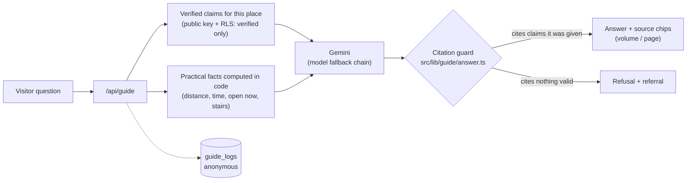

# مزارات المدينة — Mazarat Madinah

> **بالعربية:** منصة تحوّل مواضع السيرة النبوية غير المعروفة في المدينة المنورة إلى رحلات معرفية يعيشها الزائر في المكان نفسه. كل معلومة تاريخية في رحلاتها وفي إجابات مرشدها الذكي تُحال إلى صفحة من «وفاء الوفا» للسمهودي، والمرشد يعتذر حين لا يجد مصدرًا موثقًا.
>
> **In English:** A bilingual web app you can install on your phone. It turns the little-known places of the Prophet's ﷺ life in Madinah into guided knowledge journeys. Every historical statement in the journeys and in the AI guide's answers points to a page of al-Samhudi's *Wafa al-Wafa*, and the guide declines to answer when it has no verified source.

| | |
|---|---|
| **Live (Arabic)** | <https://www.mazarat-madinah.com> |
| **Live (English)** | <https://www.mazarat-madinah.com/en> |
| **Challenge** | AI Challenge Serving Islamic Content (Bathel Foundation), **Track 3: Interactive experiences and knowledge journeys** |
| **Built during the challenge** | 4–6 October 2026. See [CHANGELOG.md](CHANGELOG.md); the starting point is the tag [`pre-hackathon`](https://github.com/eslamNova/hidden-madinah/compare/pre-hackathon...master) (commit `94b5b49`) |
| **Authenticity** | [SOURCES.md](SOURCES.md): sources, editions, the claim pipeline and the review rules |
| **Architecture** | [ARCHITECTURE.md](ARCHITECTURE.md) |

---

## 60-second tour · جولة في 60 ثانية

Every link works on the live site. Add `/en` at the start of any path to see the English version of that page.

1. **A knowledge journey (about 20 s).** Open [/journeys/hijra](https://www.mazarat-madinah.com/journeys/hijra) ([English](https://www.mazarat-madinah.com/en/journeys/hijra)).
   - Answer the three-question pre-quiz.
   - Walk the four stops: Quba → Masjid al-Jumu'ah → Masjid Bani Anif → the Prophet's Mosque. Each stop can be read aloud by your device's voice, with play, pause and speed controls.
   - Answer the same questions again. The completion card shows your before and after scores. Sending the result is optional and anonymous.
2. **The AI guide, including a refusal (about 20 s).** Open [Masjid Quba](https://www.mazarat-madinah.com/places/masjid-quba) and press «اسأل المرشد» (*Ask the Guide*).
   - Ask «ما قصة هذا المكان؟» (*What is the story of this place?*). The answer cites claim ids, and its sources are listed under it with the book, volume and page.
   - Ask something the sources do not cover, such as *"Who designed the current building?"*. The guide should reply «لا أملك مصدرًا موثقًا لهذا…» (*I don't have a verified source for this…*). The place page mentions the architect, but that page text is not an approved claim, so the guide may not use it.
   - Ask for a personal religious ruling, such as *"Can I pray here on behalf of my late father?"*. The guide is instructed not to give a ruling, and the server adds the referral to the official guidance at [risala.prh.gov.sa](https://risala.prh.gov.sa).
3. **The trip planner (about 15 s).** Open [/plan](https://www.mazarat-madinah.com/plan) and type the example from our proposal: «معي ثلاث ساعات بعد العصر، ومعي والدتي وتصعب عليها المشي الطويل، ويهمنا مواضع السيرة القريبة من قباء» (*I have three hours after Asr, my mother can't walk far, and we're interested in Seerah sites near Quba*).
   - You get a door-to-door route with stops, times and a taxi fare range, and a Google Maps link. When a stop has stairs, the plan warns about it and suggests a step-free alternative if one fits.
   - The planner keeps working if the AI is down.
4. **English and QR (about 5 s).** Switch the language next to the «أ» text-size control. Then open [/places/masjid-quba?via=qr](https://www.mazarat-madinah.com/places/masjid-quba?via=qr), the address a site QR code opens (the QR sheet is printed from `/admin/qr`). Next, open [/my-journey](https://www.mazarat-madinah.com/my-journey). The visit is recorded on your device only.

> The guide runs on the free tier of Gemini. When it is busy, an answer can take up to a minute; the progress line shows each step. Only places whose claims a reviewer has approved can be answered from sources. Today those are the four places of the Hijra journey (see [Status](#status-on-6-october-2026--الحالة)). Elsewhere, the guide declines to answer history questions, which is the intended behaviour.

---

## بالعربية باختصار

**المشكلة:** يزور المدينة المنورة ملايين الزوار، وكثير منهم يغادر بعد ثلاثة مواضع فقط. السبب أن المعرفة بالمواضع الأخرى محبوسة في كتب لا يقرؤها الزائر، ومختلطة بروايات لا سند لها، ومنفصلة عن أي معلومة عملية.

**ما بُني خلال التحدي (4–6 أكتوبر 2026):**
- **قاعدة معرفة موثّقة.** 198 دعوى تاريخية لأحد عشر موضعًا، صيغت (بمساعدة الذكاء الاصطناعي) من «وفاء الوفا بأخبار دار المصطفى» للسمهودي. لكل دعوى نصّ حرفي يُتحقَّق آليًا من وجوده في الفقرة المحال إليها، وتُقابَل الفقرات آليًا بتحقيق السامرائي (طوبق منها 753 من 813، وما لم يطابَق يُعلَّم للمراجع). لا تُنشر دعوى إلا بعد اعتماد بشري.
- **مرشد ذكي يمتنع حين لا يجد مصدرًا.** يجيب من الدعاوى المعتمدة فقط ويذكر رقمها [C‹رقم›]، ويتحقق الخادم من كل إحالة. وإن لم يجد مصدرًا قال: «لا أملك مصدرًا موثقًا لهذا». أما الفتوى الشخصية فيحيلها إلى التوجيه الرسمي ولا يُفتي.
- **خمس رحلات معرفية مكتوبة:** الهجرة، وقباء والآبار، وأحد، والخندق، والمساجد الأثرية. في كل رحلة اختبار قبلي وبعدي لقياس الفهم، وسرد صوتي بصوت الجهاز. ولكل موضع تسجيل حضور برمز QR.
- **مخطِّط «عندي ساعتين، وش أزور؟».** الذكاء الاصطناعي يفهم الطلب فقط، أما المسار فيبنيه برنامج حتمي له اختبارات آلية.
- **نسخة إنجليزية كاملة** تحت ‎/en‎، تُرجمت مع مراعاة ضوابط الحزمة العلمية للتحدي.

**بصراحة:** حتى 6 أكتوبر 2026 اعتُمدت 27 دعوى فقط من 198، ونُشرت رحلة الهجرة وحدها، والبقية بانتظار المراجعة. والمراجِع اليوم هو صاحب المشروع، ومراجعة عالم متخصص مخطط لها بعد التحدي. وثلاث دعاوى كانت معتمدة (من تجربة استخراج مبكرة) تبيّن في 6 أكتوبر أنها تحيل إلى نص يخص المسجد النبوي لا قباء، فرُفضت في اليوم نفسه ولم تعد تظهر للزوار ولا للمرشد (التفاصيل في [SOURCES.md](SOURCES.md)). الترجمة الإنجليزية لم يراجعها مختص شرعي بعد. المرشد يعمل على الطبقة المجانية من Gemini فقد يبطئ أحيانًا. وعيّنة المستخدمين ما زالت صغيرة جدًا. التفاصيل في قسم [الحدود](#limitations--حدود-الحل).

---

## Why this exists · لماذا

Millions of people visit Madinah every year, and many of them leave having seen only the same three places: the Prophet's Mosque, Quba and Uhud. The city is full of other places where the Seerah actually happened: early mosques, wells, gardens and battle positions, some of them 500 m from Quba. Visitors miss them for three reasons:

- **Knowledge is locked away.** It sits in classical books that visitors don't read, mixed with oral stories that have no chain of transmission.
- **Authenticity is unclear.** Visitors can't tell sourced history from folklore, and in a religious setting that mistake matters.
- **Practical help is missing.** Nothing tells a visitor standing in the street how far a site is, whether to walk, what a taxi costs, or whether the site is open.

Mazarat Madinah answers all three. It offers journeys that tell one connected story across real places. Every historical statement in a journey or a guide answer comes from a cited claim that a reviewer has approved. Practical facts are computed for the visitor's situation. The audience includes **Muslims and non-Muslims**: the human side of the Prophet ﷺ (mercy, forgiveness, humility) comes across through what happened in real places, without preaching. All photos and videos are the owner's own, shot on site.

The design starts from **who actually visits**, and many visitors are older. The base text is 18px with a text-size stepper, zoom is never disabled, every touch target is at least 48px, journeys can be listened to, and pages already opened stay available offline (the guide and the planner's AI need a connection). Arabic is the first language (right-to-left from the first byte) and English is a full twin.

---

## What was built during the challenge · ما بُني خلال التحدي

The project existed before the challenge as a place guide: place pages, a map, curated routes, a photo tour, an admin CMS, a media pipeline, an offline-capable PWA and hidden `[VERIFY]` markers. **Everything that uses AI, plus the knowledge base, journeys, planner and English, was built inside the challenge window.** You can diff it: `git diff pre-hackathon..master` covers 176 files and about 14.6k added lines.

| Milestone | What it delivers | Evidence |
|---|---|---|
| **M0** Scaffolding | Gemini client with JSON-schema and streaming helpers, model names read from the environment. The service worker never caches AI responses. | `src/lib/ai/gemini.ts`, `src/app/sw.ts`, `scripts/gemini-models.ts` |
| **M1** Verified knowledge base | Tables for sources, claims (page, verbatim quote, al-Samarrai cross-reference, level A–D, themes, review status), journeys, quizzes and anonymous logs. Row-level security means visitors read **verified** claims only. Review console. | `supabase/migrations/006_knowledge.sql`, `scripts/content/build_wafa_corpus.py`, `scripts/content/validate_claims.py`, `scripts/import-claims.ts`, `/admin/claims` |
| **M2** AI guide with refusal | Answers only from verified claims. The server validates every citation, and an uncited factual answer is replaced by the refusal. Fatwa, family, legal and medical questions get a referral. Distances, times, opening status and stairs are computed in code. Progress is streamed live and the guide falls back to another model when one is busy. | `src/app/api/guide/route.ts`, `src/lib/guide/*`, `src/components/guide/GuideChat.tsx` |
| **M3** Journeys, QR, My journey | Five journeys written (one published so far), each with a pre-quiz, stops, a post-quiz and a completion card. Every stop script and quiz item is reviewed before it is published. Each stop also has a simplified Arabic version for children. Narration uses the device's voice. QR check-in, and a "My journey" page stored on the device. An adversarial review confirmed 33 issues, all fixed. | `content/journeys/*`, `src/components/journey/*`, `/admin/journeys`, `/admin/qr`, `supabase/migrations/008_hardening.sql` |
| **M4** Trip planner | Gemini only turns free text into five answers. A deterministic solver builds the route: door-to-door time, walking limits, stairs warnings, fare ranges. A keyword reader on the device fills the form instantly. Hotel mode prints a reception card with a QR code. | `src/lib/planner/solver.ts`, `src/lib/planner/parse.ts`, `src/app/api/plan/parse`, `/admin/hotel` |
| **M5** English | Every public page has a twin under `/en`. 471 texts were translated through three passes: translation, a faithfulness check, then an English edit. Each English place and route text is stamped with a hash of its Arabic source, so a stale translation is hidden. The guide answers in English under the same citation rules. | `src/app/(en)/`, `content/i18n/en.json`, `scripts/i18n/*`, `src/lib/i18n-content.ts` |
| **M6** Stories, tags, testimonials | `/stories`: the verified human moments grouped by theme, each with its source and place. Journey tags with filters. Visitor testimonials with explicit consent, moderated in `/admin/testimonials` before they appear on the home page. "How far am I?" on place pages, computed on the device. | `src/views/stories.tsx`, `src/lib/stories.ts`, `src/components/journey/TestimonialForm.tsx`, `src/components/place/DistanceToHere.tsx` |
| **M7** Evidence | A deterministic evaluation of the live guide (34 cases: grounded answers, refusals, fabrication traps, fatwa referrals, practical, language): **33/34** after two cases were re-run on 6 October. The first run scored 31/34; the two re-run cases had cited claim C1, which was then rejected (see [Limitations](#limitations--حدود-الحل)). The remaining failure is an over-cautious refusal. Also a report generator for the journeys' before/after quiz results. | `scripts/eval/*`, [docs/EVAL.md](docs/EVAL.md), `docs/USER_TEST.md` (generated from real results) |

Quality checks: **39 unit tests** (`npm test`) cover the planner solver (15), the keyword reader (10) and the guide's answer guard (14), plus `tsc --noEmit` and ESLint with zero warnings. No automated tests cover the API routes, the RLS policies or the UI; those were checked by hand.

---

## How authenticity is protected · كيف نحمي الموثوقية

The rule behind the design is that **the model is never the source of truth**. It rephrases and connects claims that a person has approved. When no claim supports an answer, the answer is a refusal. The full method is in **[SOURCES.md](SOURCES.md)**.

1. **One primary source.** The text is *Wafa al-Wafa bi-Akhbar Dar al-Mustafa* by al-Samhudi (d. 911 AH), in the Dar al-Kutub al-'Ilmiyya edition (1419 AH), taken from Turath (book 23695) with printed volume and page numbers.
2. **Cross-checked against the critical edition.** Each paragraph is matched against Qasim al-Samarrai's critical edition (Al-Furqan) by normalised 6-gram matching. A confident match records the critical edition's volume and page; in this build 753 of 813 paragraphs matched. A match is shown to the reviewer as a lead to check, not a confirmation, and paragraphs without a match are flagged "verify against al-Samarrai". (`scripts/content/build_wafa_corpus.py`)
3. **Small, cited claims.** Each claim records its source page, a **verbatim quote**, a content level and themes. The importer **rejects any claim whose quote does not appear word for word in the paragraph it cites**; diacritics and punctuation are ignored in the comparison. Claims enter as *pending*. (`scripts/content/validate_claims.py`, `scripts/import-claims.ts`)
4. **Human approval before publication.** In `/admin/claims` the reviewer approves, edits or rejects each claim, next to its verbatim quote and a link to the cited page on Turath. Database row-level security lets visitors read only **verified** claims of published places. The guide reads claims with the public key, so the database itself, not application code, keeps unreviewed text away from the model.
5. **A guarded answer.** The model sees only the verified claims of the current place, the current journey's places or the nearest places, each tagged `[C<id>]`, plus practical facts computed in code. The server strips any citation id it did not provide. An uncited historical answer is replaced by the refusal and a referral. (`src/lib/guide/answer.ts`, with tests)

**Content levels.** These follow the organizers' scientific package.

| Level | Scope | How the app handles it |
|---|---|---|
| **A** Established facts | Core Seerah events, authentic texts | Answered directly, with the citation |
| **B** Explanation and inference | Context, meaning | Answered from the approved claim, showing the reference, without overstating certainty |
| **C** Disputed or sensitive | Differing reports | Each view is attributed to whoever holds it, and the guide does not settle the matter |
| **D** Personal rulings | A fatwa for a specific case; family, legal, medical | Never stored as a claim (the validator rejects level D) and never ruled on. General information if it is sourced, then a referral to [risala.prh.gov.sa](https://risala.prh.gov.sa) |

**Translation.** Quran verses on place pages use the Saheeh International translation, labelled "translation of the meaning", with surah and ayah; whether it is on the package's approved list is still to be confirmed. Hadith keep their narrator and source. Arabic hedges («يُروى», «قيل») are kept. A claim's English text is shown only after the reviewer approves it together with the Arabic. On English pages the guide translates approved Arabic claims that have no reviewed English itself, and the page says so. English pages state that the translation still awaits scholarly review.

**Transparency.** An AI disclosure sits above the chat. Every cited answer lists its sources, and every guide exchange is logged anonymously (question, answer, cited claim ids, refused or not, model, latency) for review.

---

## How AI is used, and where it is not · دور الذكاء الاصطناعي

| Feature | What the model does | What code does | Safeguard |
|---|---|---|---|
| Guide | Writes a short answer from the claims it is given, in the visitor's language | Picks the claims for this place, computes distances, times, opening status and stairs, validates citations | Refusal when nothing valid is cited; referral for level D; rate limit; model fallback |
| Planner | Turns a free-text request into constraints (time, companions, mobility, interests, start) | Chooses and orders the stops, adds travel time and fares, handles stairs and step-free alternatives | Keyword reader on the device fills the form instantly; the AI answer is used only if it arrives within 8 seconds |
| Claim drafting (development time) | Proposes small claims with a quote from a numbered source paragraph | Checks every quote verbatim against its cited paragraph | Pending until a person approves it |
| Journey texts and translation (development time) | Drafts stop scripts and quiz items from the knowledge-base claims only; translates in three passes (translation, faithfulness check, English edit) | Checks that each stop cites only claims available to it (`validate_journeys.py`); hashes the Arabic source and hides English that is out of date | Human review before publication; scholarly review of the English still pending (stated on English pages) |

**Which models.** On the live site the only model is Google Gemini, called through `@google/genai` for the guide and the planner. Model names come from the environment and fall back along a list of models when the free tier is at capacity (`src/lib/ai/gemini.ts`). At development time, Claude (Anthropic) drafted 194 of the 198 claims, the journey texts and the translations, and helped write the code; it is never called by the site. The other 4 claims came from an early test of `scripts/extract-claims.ts`, which uses Gemini.

---

## Measuring learning · قياس الأثر

Track 3 asks whether a solution, tested with its audience, improves understanding of an Islamic concept or the fit and flow of the learner's journey, while respecting privacy and without inferring visitors' religious traits. Each journey therefore has a **pre-quiz and a post-quiz on the same questions**. At the end, the visitor can send an **anonymous** result: journey, language, pre and post score, stops completed, and a 1–5 rating for clarity and for flow. The only background question is optional and self-declared: how familiar the visitor is with the topic. **The app never asks about religion.** No account, name, email or location is stored (`quiz_results` in `006_knowledge.sql`; only the admin can read it).

*Status:* collection is live, but on 6 October there were fewer than five results, far too few to report anything. This README claims no result.

---

## Status on 6 October 2026 · الحالة

| | |
|---|---|
| Published places | 10 (public API) |
| Claims | 198 in the database (194 drafts in `content/claims/` plus 4 from an early test run), each quote checked word for word. **27 approved and public**: Quba 8, Masjid al-Jumu'ah 8, the Prophet's Mosque 6, Masjid Bani Anif 5. 167 pending, 4 rejected (3 of them, C1–C3, on 6 October; see [Limitations](#limitations--حدود-الحل)) |
| Journeys | 5 written. **1 published** (Hijra, 4 stops, 3 quiz questions); 4 await review |
| English | 471 texts translated; scholarly review pending |
| Tests | 39 passing (`npm test`) |
| Running cost | About $0 a month on free tiers, apart from the domain (Vercel Hobby, Supabase free, Cloudflare R2 with zero egress, Gemini free tier) |

---

## Architecture · البنية

**Stack:** Next.js 15 (App Router, static pages with ISR) and React 19 · TypeScript · Supabase (Postgres, Auth, row-level security, Storage) · Google Gemini · Vercel · Cloudflare R2 for media · MapLibre GL 5 with OpenFreeMap tiles · Serwist (offline PWA) · next-intl · Tailwind CSS 4. Details are in **[ARCHITECTURE.md](ARCHITECTURE.md)**.



- **Two root layouts.** `src/app/(ar)` and `src/app/(en)/en` set the right `lang`/`dir` from the first byte. Page bodies are shared through `src/views/`, and every public page stays static.
- **Reads and writes.** Public pages read only published or verified rows through RLS. Admin writes go through Supabase Auth plus an `admin_users` allowlist, and an admin edit refreshes both languages.
- **Privacy by default.** Visitors have no accounts. "My journey" and quiz progress live in the browser. GA4 is not loaded at all until the visitor consents, while Vercel Analytics is cookieless. The text of guide questions and planner requests is sent to Google's Gemini API; the privacy page says so and asks visitors not to include personal information.

---

## Run it locally · التشغيل محليًا

**Prerequisites:** Node.js 22+ (Node 20 works for the app, but the scripts then need `NODE_OPTIONS=--experimental-websocket`), a Supabase project, and a Gemini API key for the guide. Python 3 (standard library only) is needed for the content scripts, and ffmpeg only for importing video.

```bash
npm install
cp .env.example .env.local      # then fill in the values (names below)
npm run dev                     # http://localhost:3000  (English: /en)
npm test                        # 39 unit tests: planner, keyword reader, guide guard
```

**Environment variables** (names only; see [.env.example](.env.example) for what each one does):

| Variable | Used by |
|---|---|
| `NEXT_PUBLIC_SUPABASE_URL` | App and scripts |
| `NEXT_PUBLIC_SUPABASE_ANON_KEY` | App (public key; RLS applies) |
| `SUPABASE_SERVICE_ROLE_KEY` | Local scripts only. Never put it in the browser, in Vercel or in git |
| `REVALIDATE_SECRET` | `POST /api/revalidate` |
| `NEXT_PUBLIC_SITE_URL` | Canonical and Open Graph URLs (`http://localhost:3000` locally) |
| `NEXT_PUBLIC_GA_ID` | Production only. Leave it unset locally, which keeps analytics and the consent notice off |
| `GEMINI_API_KEY` | Guide, planner parsing, `scripts/extract-claims.ts` (server-side only) |
| `GEMINI_MODEL_FAST` / `GEMINI_MODEL_SMART` | Visitor-facing calls (guide, planner) / offline claim extraction (`scripts/extract-claims.ts`). List the models available to your key with `npx tsx scripts/gemini-models.ts` |
| `GEMINI_FALLBACK_MODELS` | Optional, comma-separated models tried when the primary one is at capacity. Not in `.env.example`; `src/lib/ai/gemini.ts` has a default list |

**Database:**
1. Apply `supabase/migrations/001…008` in order (SQL editor or Supabase CLI), then run `supabase/seed.sql`, which is safe to re-run. Then re-run `007_journeys_seed.sql` (also re-runnable), so the journey stops link to the places the seed created.
2. Create an owner account with `npx tsx scripts/create-owner.ts --email … --password …` (or set `OWNER_EMAIL` / `OWNER_PASSWORD` in `.env.local`).
3. Imported claims and journeys stay **pending**. They appear on the public pages only after you approve them in `/admin/claims` and `/admin/journeys`.

**What a fresh database contains.** `seed.sql` is an earlier content pack (the Quba area plus placeholder places), not a copy of production. Five of the ten published places exist only in the production database, and the journey drafts in `content/journeys/*.json` point at production journey-stop and claim ids. A fresh database therefore runs the app, the guide, the planner and the review workflow, but it does not reproduce the live content exactly.

**Without a Gemini key** the site, journeys and planner form still work: the planner falls back to its keyword reader. The guide replies that it cannot be reached.

| npm script | Does |
|---|---|
| `npm run dev` | Development server |
| `npm run build` / `npm start` | Production build and serve. Run `rm -rf .next` first after content changes, because Next's fetch cache can serve day-old data |
| `npm test` | Unit tests (`node --test` with `tsx`) |
| `npm run lint` | ESLint. The stricter check this build passes: `npx eslint src scripts --max-warnings=0` and `npx tsc --noEmit` (there is no CI pipeline) |

**Content pipeline** (offline, run in order):

| Step | Command |
|---|---|
| Build the source corpus (Turath text, matched against al-Samarrai) | `python scripts/content/build_wafa_corpus.py`. The al-Samarrai scans are private and not in the repo; without them every paragraph stays flagged as unmatched |
| Draft claims | Write drafts into `content/claims/<slug>.json` from the corpus paragraphs (how the current 194 drafts were made), or run `npx tsx scripts/extract-claims.ts --place <slug> [--dry-run]`, which drafts with Gemini and inserts the claims as pending directly |
| Validate quotes word for word | `python scripts/content/validate_claims.py <slug> …` |
| Import claims as pending | `npx tsx scripts/import-claims.ts [--place <slug>] [--dry-run]` |
| Validate and import journeys (pending) | `python scripts/content/validate_journeys.py <slug>` then `npx tsx scripts/import-journeys.ts [--journey <slug>]` |
| English content (hash-stamped) | `npx tsx scripts/i18n/dump-ar-content.mts <out.json>`, translate, then `npx tsx scripts/i18n/assemble-en.mts <ar.json> <translations.json>` |
| Media (photos and video, then R2) | `npx tsx scripts/import-media.ts --dir "<folder>" --slug <slug>` then `node scripts/sync-media-to-r2.mjs` (needs a logged-in `wrangler`; the bucket and media domain are set in the script) |

---

## Repository map · خريطة المستودع

```
src/
  app/(ar)/…              Arabic pages (lang=ar, dir=rtl); review console under (ar)/admin
  app/(en)/en/…           English twins (lang=en, dir=ltr)
  app/api/guide/          AI guide: claim context, streaming, citation guard, anonymous log
  app/api/plan/parse/     Planner: free text → constraints (Gemini, with timeout)
  app/api/revalidate/     On-demand refresh after admin edits
  views/                  Page bodies shared by both languages
  components/             guide/, journey/, planner/, place/, map/, tour/, admin/, layout/ …
  lib/guide/              context.ts (claims + computed facts), prompt.ts, answer.ts (+ tests)
  lib/planner/            solver.ts (deterministic), parse.ts (keyword reader) (+ tests)
  lib/ai/gemini.ts        Gemini client, JSON schema, streaming, model fallback
  lib/i18n*.ts            Language routing, hash-stamped English content
  lib/content.ts          Public DTOs, [VERIFY] stripping
  fonts/                  thmanyah typeface (proprietary; see Licences)
messages/                 Interface strings (ar.json, en.json)
content/claims/           Drafted claims per place (source paragraph + verbatim quote)
content/journeys/         Journey scripts and quiz items
content/i18n/en.json      English place/route texts with source hashes
scripts/content/          Corpus builder and validators (Python, standard library)
scripts/i18n/             Translation dump / assemble
scripts/                  Claim/journey/media import, icons, owner creation
supabase/migrations/      001–008: schema, RLS, storage, knowledge base, hardening
public/                   Icons, hero images, share image, RTL text plugin
```

---

## Licences and credits · التراخيص والشكر

- **Code.** No open-source licence has been chosen yet. Until a `LICENSE` file is added, the code is published for review and all rights are reserved by the team.
- **Photos and videos.** The owner's original work, shot on site. All rights reserved. Published files carry no EXIF or GPS data.
- **Typeface: thmanyah** (`src/fonts/`, loaded in `src/lib/fonts.ts`). Proprietary. thmanyah gave written permission (8 September 2026) to self-host it **for rendering this site only**, on two conditions: no direct download link and no hotlinking. A CORS rule in `next.config.ts` limits the font files to the production origin. The licence also forbids modification, so the files are shipped byte for byte and never subset. **They are not covered by any licence of this repository and may not be reused.** To build a fork, put your own licensed font files in `src/fonts/` and update `src/lib/fonts.ts`.
- **Source texts.**
  - *Wafa al-Wafa* by al-Samhudi: the Dar al-Kutub al-'Ilmiyya edition (1419 AH), via Turath's public API.
  - Al-Samarrai's critical edition (Al-Furqan): used only to cross-check page references. The scans are not in this repository.
  - Quran translation of the meaning: Saheeh International.
- **Map.** Data © OpenStreetMap contributors. Tiles from [OpenFreeMap](https://openfreemap.org). Rendered by MapLibre GL JS (BSD-3-Clause) with `@mapbox/mapbox-gl-rtl-text` (BSD-2-Clause).
- **Libraries.** Next.js, React, next-intl, Serwist, Tailwind CSS, motion, supabase-js, qrcode, exifr, browser-image-compression, `@vercel/analytics` (all MIT); lucide-react (ISC); `@google/genai` and sharp (Apache-2.0; sharp bundles libvips under LGPL-3.0 and is used only by the scripts).
- **Third-party services.**
  - Hosting and data: Google Gemini API, Supabase, Vercel, Cloudflare R2.
  - Analytics: Google Analytics 4 (production only, after consent) and Vercel Analytics.
  - Narration: the Web Speech voices of the visitor's own device.
- **Referrals and recommendations.**
  - Religious questions go to the official guidance of the Two Holy Mosques at [risala.prh.gov.sa](https://risala.prh.gov.sa).
  - Place pages recommend the free «سيرة» Seerah audio app (third party).
  - Our [Telegram channel](https://t.me/+j_RAlim-5ZE2MTJk) handles site questions.

---

## Limitations · حدود الحل

- **Most claims are still pending.** 27 of 198 claims are approved, so the guide can answer history questions only at the four Hijra-journey places, and only the Hijra journey is published. This is deliberate: nothing reaches visitors before review. The owner does the reviewing today, and a scholar's re-check is planned after the challenge. Until then, the guide disclosure's "reviewed by a specialist" means the project's own content reviewer.
- **Three approved claims were wrong, and were rejected on 6 October.** C1, C2 and C3 came from an early test run and were approved before the current pipeline existed. On 6 October we found that their cited page (vol. 1 p. 66) lists merits of the Prophet's Mosque, not Quba; C1 also said the reward of praying at Quba equals a Hajj, while the hadith says an Umrah. The verbatim check passed because the quote is real; the context was misread. They were rejected the same day and are no longer shown to visitors or given to the guide. Until then the error reached visitors with a citation attached: two evaluation cases cited C1, and both pass after the rejection ([docs/EVAL.md](docs/EVAL.md)). Details are in [SOURCES.md](SOURCES.md) §15.1.
- **The al-Samarrai cross-check is advisory.** Approval does not yet record a manual check in the critical edition, and 12 of the 194 drafts cite a paragraph with no automatic match.
- **Hadith gradings and Quran text are not independently checked yet.** Gradings are quoted only where al-Samhudi states them; verse text has not been checked against the King Fahd Complex text.
- **The English translation has had no scholarly review yet**, and English pages say so. A place or route text whose Arabic changes is hidden until it is translated again. Claims are not hash-stamped yet, so a claim's English is not always flagged when a reviewer edits its Arabic.
- **The citation guard checks that citations are present and real, not meaning.** It catches invented ids and uncited answers, but it does not prove that every sentence is supported by the claim it cites. The prompt, the small claim set per place, and the logging of every answer for review limit that risk.
- **The AI runs on the free tier.** Gemini quotas and capacity errors can slow the guide, even with the model fallback chain. The planner never depends on the AI.
- **One primary source.** The knowledge base draws on *Wafa al-Wafa* only. Other works named in our proposal (Sahih al-Bukhari, Sahih Muslim, Ibn Shabba's *Tarikh al-Madinah* and others) appear only where al-Samhudi quotes them. They have not been added as separate sources yet.
- **The user sample is small.** The pre/post quiz is in place, but no learning gain is claimed yet.
- **Narration uses the device's voice**, so quality depends on the phone. Recorded or neural narration is not built.
- **Infrastructure runs on free tiers.** The Supabase free tier pauses after about a week without traffic. Paid tiers are needed before any promotion.
- **One person creates the content.** Each new place needs a site visit, photography and source work.
- **Reproducing the live content needs the production database** (see [What a fresh database contains](#run-it-locally--التشغيل-محليًا)).

## Planned, not built · خطط لم تُنفَّذ بعد

These ideas come from our proposal (the place target comes from our earlier research notes). They are not part of the judged build unless they appear in [CHANGELOG.md](CHANGELOG.md):

- Children's narration for every place, aimed at ages 8–14. Today only the journey stops have a simplified Arabic version, and there is none in English.
- Seasonal, evening and first-visit tours as journeys of their own (journeys already carry these tags and can be filtered by them).
- Packages for hotels beyond the reception card, and use by local guides.
- Recorded audio.
- Growing from 11 places to 30–50.
- A scholar's review of the claims, the journey texts and the English text.

**Sustainability.** Running costs are close to zero today. The revenue plan is **direct sponsorship by vetted, relevant businesses** (Umrah operators, hotels near the Haram, ziyarah transport, Islamic publishers), always clearly labelled. The project will **never use programmatic ad networks**, because trust is the whole asset. The review workflow (`/admin/claims`, `/admin/journeys`) lets the owner keep publishing content after the challenge.
